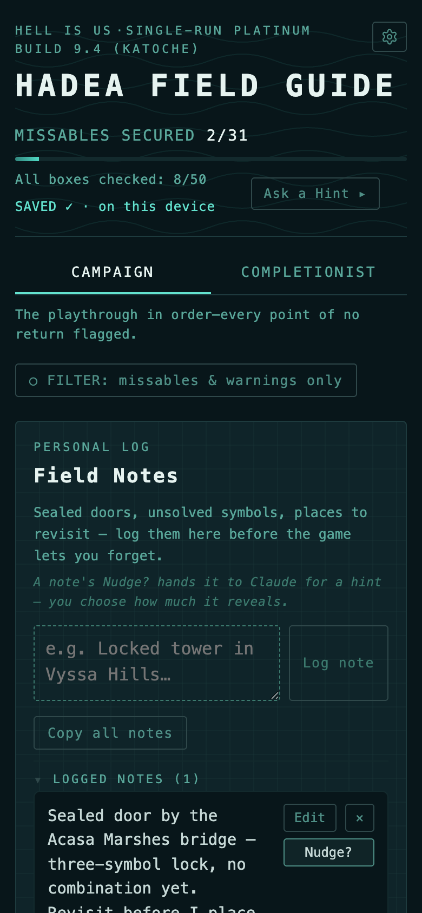
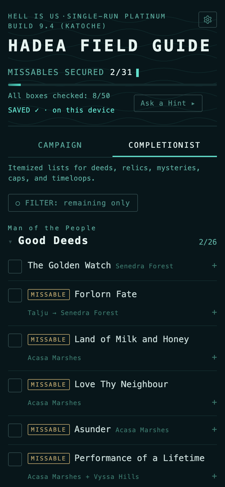
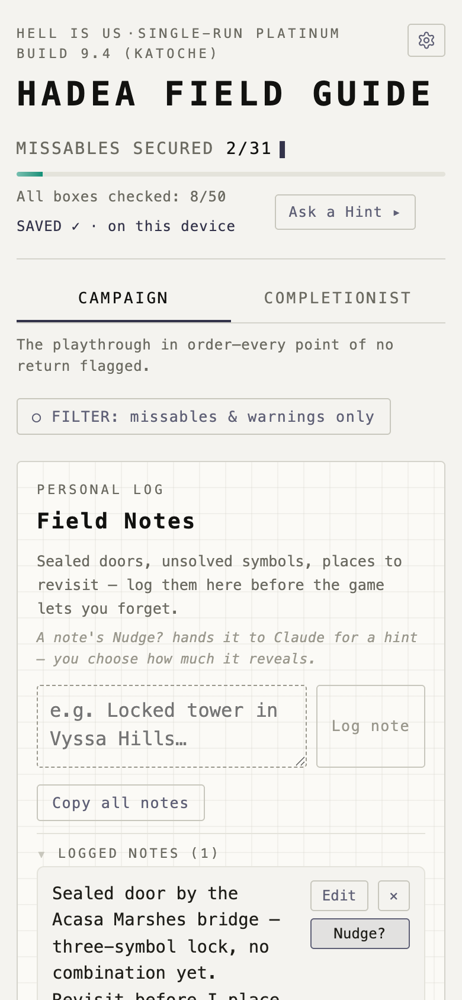

# Hadea Field Guide

A standalone companion for the **Hell is Us** (Rogue Factor, 2025) platinum trophy: a chronological, spoiler-light checklist that flags every point of no return, tracks all 122 collectibles, and holds your own field notes — with optional hints from Claude when you're stuck, from a gentle nudge to the full answer. Installable on iPhone or Android, works fully offline — no account, no server, nothing leaves your device.

**Live:** https://pawnee-projects.github.io/HiU-Platinum/

> ⚠️ Light spoilers: checklist entries name NPCs, locations, and side-quest titles. No story content. The screenshots below include a few.

  
  &nbsp;
  
  &nbsp;
  

## Using it

Open the link, tap around. To install it as a full-screen app with its own icon:

- **iOS 26+:** Safari → Share → **Add to Home Screen** (keep "Open as Web App" on).
- **Android:** Chrome → ⋮ menu → **Install app** (or **Add to Home screen**) → creates a standalone WebAPK.

- Tap phase headers to collapse acts you've finished — the fold state persists
- **Nudge / Hint / Spoil** copies a ready-made prompt and opens Claude; paste if the composer arrives empty
- All progress lives in *your* browser on *your* device. Nothing is stored server-side; this repo only serves the page

## Where the data lives (read before doing anything drastic)

Progress and notes live in `localStorage`, scoped per browser per device. The storage rules differ by platform:

- **iOS:** the home-screen web app has its **own storage container, separate from Safari** — always enter progress through the icon; progress in one is invisible to the other. Home-screen apps are exempt from Safari's 7-day storage cleanup (using the app resets the timer regardless). **Deleting the home-screen icon deletes its data** — Export first.
- **Android:** the installed app **shares** storage with the same-origin Chrome tab (no silo), and **uninstalling does not wipe your data** — it lives in the Chrome profile until you clear the site's data. No inactivity eviction. On install the app also requests *persistent* storage, so it's evictable only under real disk pressure.

**Export backup** downloads your run as JSON; **Import backup** restores it. Export at milestones regardless of platform — it takes ten seconds and has already justified itself.

## Build log

Recent notable releases (micro-patches rolled into their minor version; codenames in parentheses):

- **9.7 (MILLINER)** — **Campaign readability pass + cap cleanup.** Checklist rows now read name-first, with the location and any timing/step note as smaller secondary labels (warnings in red), matching the Completionist view — deeds show their real names, multi-step quests read *(N of M)*, and a 🏆 flags trophy requirements. On the caps: dropped the redundant "Cap – " prefix and corrected four mis-named ones. Plus a round of wording tidy-ups, the two Incognito rows now share one check, and the first-visit note nudges you to install to your Home Screen.
- **9.6 (SURVEY)** — **Zone lens for the Completionist view.** A **By category / By zone** switch regroups the collectible ledger by the game's 15 regions, in world-progression order (Senedra Forest → the Vaults of Forbidden Knowledge), each with its own done-count. Paired with the **Remaining only** filter it becomes a literal per-region cleanup list — everything still open where you're standing. Multi-region items appear under each region they touch and share one checkbox, so ticking it anywhere updates it everywhere. (The lone region-less row, the starting cap, sits in a trailing *Unverified* group.) Also fixed a layout bug where tag-led checklist rows rendered too tall — the tag no longer drops onto its own line above a wrapped title.
- **9.5 (PARLEY)** — **Conversation-target glyph.** A small speech-bubble in the UI-accent colour now marks every Campaign row that opens a full dialogue screen — the 21 NPCs the *Lend an Ear* trophy counts — sitting right before the NPC's name (e.g. *Jova —* 🗨 *Captain Vaas*). The "Talk 🗨 to every named NPC" Standing Order carries the same glyph as a legend, with a parenthetical bubble in its notes. The icon is an inline vector tinted with the active theme's accent, like the Settings gear.
- **9.4 (KATOCHE)** — **Datapad (dark) redrawn** toward the in-game cyan-on-teal-black interface: teal-black ground, cyan chrome, layered text (the notes and checklist items you read stay near-white; the app's own labels take a teal cast), muted-brass missables and cyan-blue story tags, RULE/SAFE quieted onto their own tones, and a faint topographic contour on the header and Settings sheet. Parchment (light) is unchanged.
- **9.3 (BEACON)** — Settings gear is now a crisp inline vector cog; **Datapad (dark) is the first-launch default** (Auto / Parchment one tap away in Settings); source credits and Settings copy tidied; the third reveal level reads **Spoil**; service-worker updates now land reliably on every redeploy.
- **9.2 (LANDFALL)** — First-class **Android install**: the app is an installable PWA (Chrome ⋮ → Install app → WebAPK), via a web manifest with relative scope, purpose-tagged icons (a maskable trophy for Android's adaptive mask), and a request for persistent storage. The iOS icon is unchanged.
- **9.1 (HADEA)** — **Colour redesign + light/dark theming.** The "Hadea Cold" palette with two surfaces — **Datapad** (dark) and **Parchment** (light) — chosen from a new ⚙ Settings sheet. Content accents colour game content only; all interface chrome is neutral. Export / Import / Reset and an About group moved into Settings; the hint reveal became a segmented picker + one **Ask**.
- **9.0 (FRONTIER)** — The checklist becomes a **self-organizing surface**: completed phases flip to a done state in place with a **Tuck away ↓** control that folds them into a COMPLETED zone; unchecking a secured box auto-surfaces its phase. PHASE 00 became **Standing Orders**; hints moved to an **Ask for a Hint** chip.
- **8.6 (AMEND)** — Logged field notes are **editable in place** (Edit → Save / Cancel); the note's original date is preserved.

Earlier releases (7.0 – 8.5)

- **8.5 (CLEAR)** — When all 31 missables are secured, the header readout flips to a **THREATS: CLEAR** treatment.
- **8.4 (BACKUP)** — Footer shows "Last export: N days ago" (stamped on Export); turns amber after a week or if you've never backed up.
- **8.3 (WELCOME)** — Dismissible first-visit notice (what this is, light-spoiler warning, data-stays-local); dismissal persists per device.
- **8.2 (FLARES)** — The four "A Light in the Dark" flare deeds track individually in the Completionist view; the Campaign's single flares row aggregates them.
- **8.1 (OFFLINE)** — Cache-first service worker; the app opens and works with no network after the first visit. Caches only its own files.
- **8.0 (COMPLETIONIST)** — Second top-level tab: an itemized ledger of 122 collectibles with per-category counts, the fold mechanic, and a "Remaining only" filter. Ledger checkboxes are shared with the Campaign view.
- **7.2** — Icon badge inset past Apple's corner mask; note boxes sized for the 16px font.
- **7.1** — Larger type; collapsible, persistent phases; hint box folded behind "Stuck?".
- **7.0 (STANDALONE)** — Left claude.ai: vanilla JS, localStorage + export/import, hint handoff via a prefilled Claude link, home-screen icon.

## Credits

Checklist compiled July 2026 from [PowerPyx](https://www.powerpyx.com/hell-is-us-trophy-guide-roadmap/) (trophy, missables & walkthrough pages + reader reports), [Game8](https://game8.co/games/Hell-is-Us), [Neoseeker](https://www.neoseeker.com/hell-is-us/walkthrough), [PSNProfiles](https://psnprofiles.com/trophies/35802-hell-is-us) & [TrueTrophies](https://www.truetrophies.com/game/Hell-is-Us/trophies) threads, and [Fextralife patch notes](https://hellisus.wiki.fextralife.com/Patch_Notes) (1.4–1.6). Game and artwork © Rogue Factor / Nacon — this is an unaffiliated fan tool.

## License

Source-available under the [PolyForm Noncommercial License 1.0.0](LICENSE.md) © 2026 Pawnee Projects — free to use, fork, study, and adapt for any **noncommercial** purpose; selling it or using it commercially is not permitted. The license covers the app code and checklist compilation; the game, its name, and artwork are © Rogue Factor / Nacon and are not.
